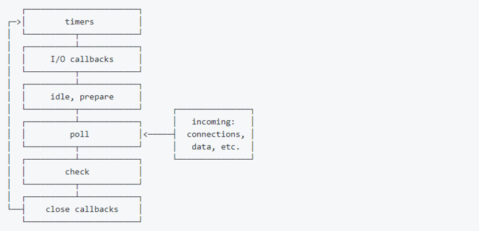

### 关于new和prototype

#### 使用new调用函数
1. 创建（或者构造）一个全新的对象
2. 对这个新对象执行原型链接
3. 绑定函数调用的this
4. 如果函数没有返回其他对象，那么new 表达式中的函数调用会自动返回这个新对象

#### 关于prototype
js中每个对象都有一个特殊的[[Prototype]]内置属性，其实就是对于其他对象的引用。  
如果查找某个属性时，对象本身上不存在，就继续访问[[Prototype]]链，即原型链。  
以下面代码为例：
```
  funtion Foo() {};

  Foo.prototype.a = 2;

  let s = new Foo();

  s.a; // 2

```
简单来说，Foo.prototype也是一个对象，但与普通对象不同的是，
当使用new实例化时，Foo.prototype会被关联到实例的原型链上。如果不使用new实例化，则不会关联上。
```
funtion Foo() {};

Foo.prototype.a = 2;

let s = Foo();

s.a // TypeError: Cannot read property 'a' of undefined
```

prototype.constructor指向函数本身
```
funtion Foo() {};

Foo.prototype.constructor === Foo; // true

```
一个函数本身不是构造函数，但若使用了new调用，则这个函数可以被称为构造函数,.constructor是函数声明时的默认属性。且通过new实例化的对象的constructor实际上是.prototype.constructor,其本身并不存在constructor。

使用Object.create创建新对象时，会把新对象内部的[[prototype]]关联到指定对象
```
  let foo = {
    a: 1
  };

  let b = Object.create(foo);

  //注对象不存在prototype，但在浏览器环境可通过.__protp__查看，如b.__proto__
  b.prototype === foo // true
```

### 关于class

class实际上是原型继承的语法糖。js本身没有类的概念，甚至没有继承的概念，所谓的‘继承’实际上是原型关联。在如java等语言中继承和实例化某种程度上相当于是复制了父类，实例化了一份拷贝，然后在这份拷贝上修改。

但是js并不是拷贝，js中的大多数东西都是对象，我们所实现的继承实际只是在原型链上多了层关联。

### 事件循环小结

事件循环分为浏览器环境和node环境，分别简单梳理下这两个环境下的事件循环。

#### 浏览器环境

浏览器环境下可以简单理解为有一个执行栈和一个任务队列，执行栈执行同步任务，任务队列执行异步任务。

当执行栈执行完毕后，才开始执行任务队列里的任务，执行顺序以进入任务队列的顺序为准。

需要注意的是Promise，了解Promise的实现就知道，传入的函数是同步任务，resolve，reject是异步任务。而且Promise.then()的优先级高于普通异步任务如setTimeOut。

```
setTimeout(() => {
  console.log(5);
}, 0);
console.log(2);
new Promise((resolve, reject) => {
  console.log(3);
  resolve(4);
}).then(val => {
  console.log(val);
});

// 2
// 3
// 4
// 5

```
以一句话概括就是'从宏任务队列中取一个任务执行，再取出微任务队列中的所有任务'。

#### node环境
node的新加入了process.nextTick和setImmediate两个新的api。其中nextTick和Promise在一个阶段，但优先级高于Promise。setImmediate描述上说是添加到任务队列最后，但这个描叙有一定歧义，实际使用上并不如此。

我们先看下node的循环流程

主要注意下poll阶段，引用[前辈的原文](https://segmentfault.com/a/1190000013102056)

* poll队列不为空的时候，事件循环肯定是先遍历队列并同步执行回调，直到队列清空或执行回调数达到系统上限。
* poll队列为空的时候，这里有两种情况。
  * 如果代码已经被setImmediate()设定了回调，那么事件循环直接结束poll阶段进入check阶段来执行check队列里的回调。
  * 如果代码没有被设定setImmediate()设定回调：
    * 如果有被设定的timers，那么此时事件循环会检查timers，如果有一个或多个timers下限时间已经到达，那么事件循环将绕回timers阶段，并执行timers的有效回调队列。
    * 如果没有被设定timers，这个时候事件循环是阻塞在poll阶段等待回调被加入poll队列。
setTimeout和setImmediate在调用中的执行顺序为：

* 如果两者都在主模块中调用，那么执行先后取决于进程性能，也就是随机。
* 如果两者都不在主模块调用（被一个异步操作包裹），那么setImmediate的回调永远先执行。

第一点是因为，setTimeout有一个最小调用时间，性能足够好时，可能执行到timer阶段时，最小调用时间还没到，于是进入pool阶段再到check于是就先执行了setImmediate。性能不够时当然时先执行setTimeout。

第二点是因为node回调的Api大多在pool阶段执行。当回调执行时，setTimeout进入timer，此时有setImmediate,于是先执行check。

### react事件系统和setState

简单记录下react事件系统和setState的特性，有空完整解析事件系统和setState

#### 事件系统

react事件可以简单理解为，react事件以类似事件池的方式，挂载在document上。原生事件冒泡完毕后，在进入react的事件系统中。

#### setState

setState在react系统中是异步的，在原生环境下是同步的

